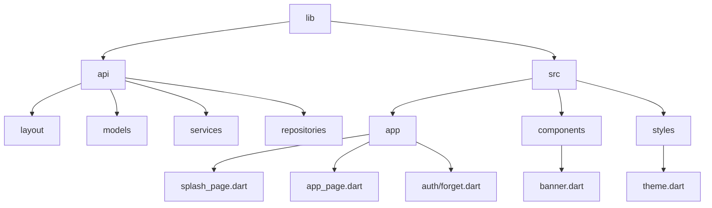
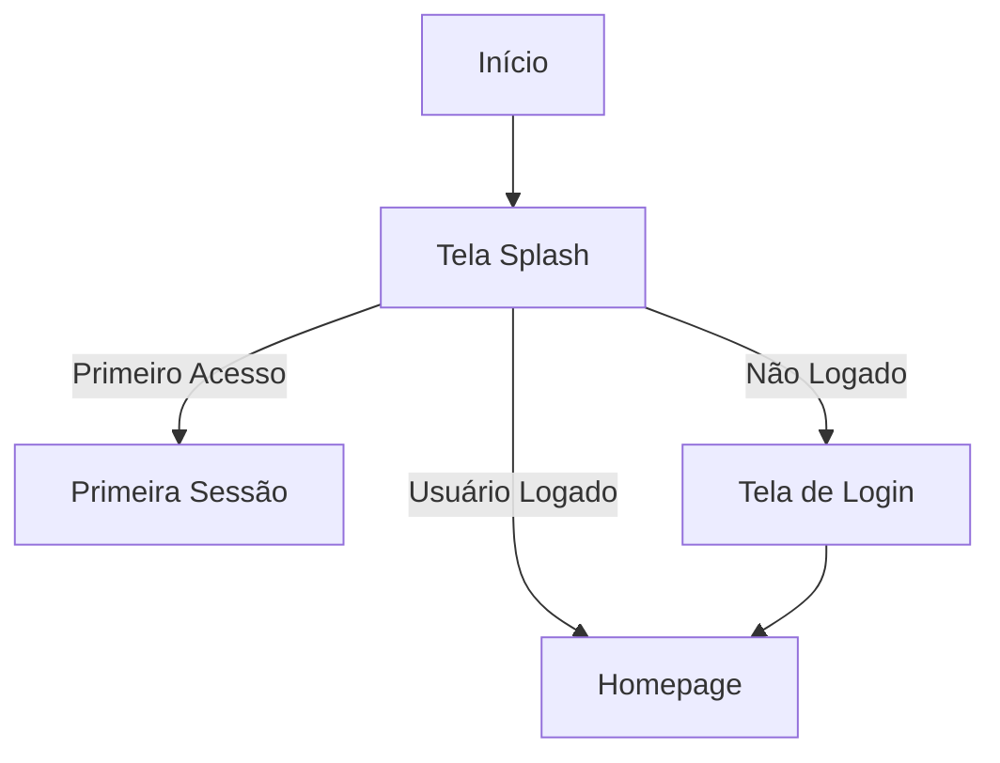

# FlutterGo

O **FlutterGo** é um projeto desenvolvido em **Flutter**, utilizando a linguagem **Dart**, para criar uma aplicação moderna, com funcionalidades robustas e design responsivo. Este repositório é projetado para atender aos mais altos padrões de desenvolvimento, sendo modular, escalável e de fácil manutenção. O projeto é ideal para aplicações que requerem integração com APIs, controle de estado e uma interface de usuário dinâmica.

---

## 📂 Estrutura do Repositório

A estrutura do projeto foi cuidadosamente organizada para separar responsabilidades e facilitar o desenvolvimento. Abaixo está o detalhamento das principais pastas e seus objetivos dentro do repositório:

### **Pasta `lib`**

A pasta `lib` é o núcleo do projeto e contém todo o código-fonte da aplicação. Ela está subdividida em dois diretórios principais: `api` e `src`.

---

### **1. Pasta `lib/api`**

O diretório `api` é responsável por gerenciar a comunicação com APIs externas, modelos de dados e repositórios. Ele segue um padrão MVVM (Model-View-ViewModel), garantindo uma arquitetura limpa e escalável.

#### Principais Subpastas:

- **`layout/`**: Contém classes de gerenciamento de exibição de dados, como `user_view_model` e `product_view_model`. Essas classes encapsulam a lógica necessária para interagir com os dados e preparar as informações para serem exibidas.
  
- **`models/`**: Define os modelos de dados utilizados na aplicação. Cada modelo é responsável por mapear os dados recebidos das APIs para objetos da aplicação. Exemplos incluem:
  - `UserModels`: Representa os dados do usuário, como ID, e-mail, nome, avatar, entre outros.
  - `ProductModels`: Representa os dados de produtos, incluindo preço, nome, imagem e promoções.

- **`services/`**: Contém serviços auxiliares e utilitários, como:
  - **`notification_client_service.dart`**: Gerencia notificações no dispositivo.
  - **`socket_client_service.dart`**: Facilita a comunicação em tempo real via WebSockets.
  - **`shared_local_storage_service.dart`**: Fornece suporte para armazenamento local.

- **`repositories/`**: Implementa repositórios responsáveis por acessar, manipular e atualizar os dados da API. Exemplos:
  - `UserRepository`: Gerencia operações relacionadas ao usuário, como login, registro e redefinição de senha.
  - `ProductRepository`: Fornece métodos para buscar e manipular dados de produtos.

---

### **2. Pasta `lib/src`**

A pasta `src` concentra todas as funcionalidades relacionadas à interface do usuário e controle de navegação do aplicativo.

#### Principais Subpastas:

- **`app/`**: Implementa as páginas do aplicativo e a lógica de navegação. Destaques:
  - **`app_page.dart`**: Ponto de entrada principal para a aplicação. Configura temas globais e define o widget raiz.
  - **`splash_page.dart`**: Tela inicial responsável por verificar o estado do usuário (primeiro acesso, login ou redirecionamento para a homepage).
  - **`auth/forget.dart`**: Página de recuperação de senha. Inclui validações de e-mails e integração com o repositório de usuários.

- **`components/`**: Contém componentes reutilizáveis que melhoram a modularidade do projeto. Exemplos:
  - **`banner.dart`**: Exibe banners promocionais com informações de produtos, utilizando `FutureBuilder` para carregar dados dinamicamente.

- **`styles/`**: Define temas e estilos globais para a aplicação. Destaques:
  - **`theme.dart`**: Gerencia os temas claro e escuro, ajustando também o status bar e a barra de navegação para se alinhar ao tema ativo.

---

## 🖥️ Arquitetura do Código

A aplicação segue uma arquitetura baseada no padrão MVVM, com separação clara entre camadas:

1. **Models**: Representam os dados e são responsáveis por mapear objetos JSON para objetos Dart.
2. **ViewModels**: Encapsulam a lógica de interação com os dados e fornecem as informações necessárias para as Views.
3. **Views**: Definem os widgets que compõem a interface do usuário.

Esse padrão garante:
- Alta coesão e baixo acoplamento.
- Facilidade de manutenção e escalabilidade.
- Testabilidade do código.

---

## 🌟 Funcionalidades do Projeto

### **1. Splash Screen**
A tela inicial (`SplashPage`) é exibida ao abrir o aplicativo. Ela realiza as seguintes verificações:
- **Usuário logado?** Caso positivo, redireciona para a homepage.
- **Primeiro acesso?** Caso positivo, redireciona para a tela de configuração inicial.
- **Não logado?** Redireciona para a tela de login.

### **2. Recuperação de Senha**
A página `Forget` permite que os usuários redefinam suas senhas. Recursos incluem:
- Validação de e-mail com expressões regulares.
- Integração com o repositório de usuários para envio de solicitações de redefinição.

### **3. Componentes Reutilizáveis**
O componente `BannerComponent` exibe uma lista horizontal de produtos. Ele utiliza o `FutureBuilder` para buscar dados dinamicamente e oferece:
- Exibição de imagem, nome e preço do produto.
- Redirecionamento para a página de detalhes do produto ao clicar no banner.

---

## 🎨 Temas e Estilização

O aplicativo utiliza a classe `PreferencesTheme` para gerenciar os temas claro e escuro. Principais características:
- Alteração automática do tema com base no brilho do sistema.
- Configuração de cores primárias, fontes e comportamento do status bar.

O tema principal utiliza a cor azul primária (`#005BE2`) e a fonte `Rubik`, proporcionando uma estética moderna e profissional.

---

## 🚀 Inicialização do Projeto

O ponto de entrada do aplicativo está no arquivo `main.dart`. Ele realiza as seguintes ações:
1. Inicializa o binding do Flutter com `WidgetsFlutterBinding.ensureInitialized()`.
2. Carrega variáveis de ambiente do arquivo `.env` usando o pacote `flutter_dotenv`.
3. Inicializa serviços essenciais, como notificações (`NotificationService`).
4. Executa o aplicativo com `runApp(App())`.

---

## 📊 Diagrama de Fluxo do Aplicativo

---

## 🛠️ Tecnologias Utilizadas

- **Flutter**: Framework para construção de interfaces de usuário nativas.
- **Dart**: Linguagem principal para desenvolvimento.
- **flutter_dotenv**: Gerenciamento de variáveis de ambiente.
- **FutureBuilder**: Para renderização assíncrona de widgets.

---

## 👥 Contribuição

Contribuições são bem-vindas! Para contribuir:
1. Faça um fork do repositório.
2. Crie uma nova branch: `git checkout -b minha-feature`.
3. Faça suas alterações e commit: `git commit -m "Minha nova feature"`.
4. Envie para o repositório remoto: `git push origin minha-feature`.
5. Abra um Pull Request.

---

## 📄 Licença

Este projeto está licenciado sob a [MIT License](./LICENSE).
